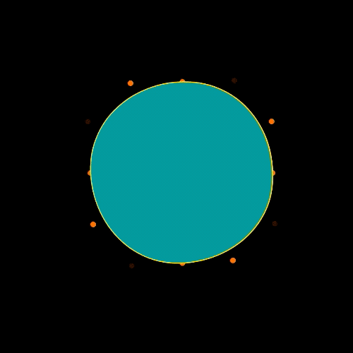
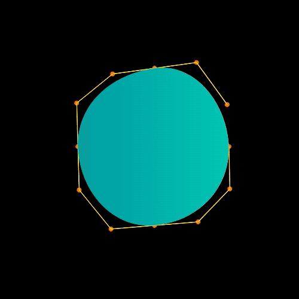

# voice-feedback-visualizer

A prototype of a microphone visualizer for user input voice commands in a UI display.

## Reconstructing the animation

### Place vertices

Microphone activity level is mapped into multiple vertices drawn in a circumference using Polar coordinates. Each vertex responds slightly different to the microphone level using a limited random value. A polygon shape is created from these vertices.

### Bezier curves

The vertices are used as control points to create bezier curves, these connect with each other in a loop to form an oval shape that replaces the polygon.

### Tangential movement

Vertex movement is adjusted to move tangentially with each counterpart, as a result the oval bezier curves should distort with an organic motion.

